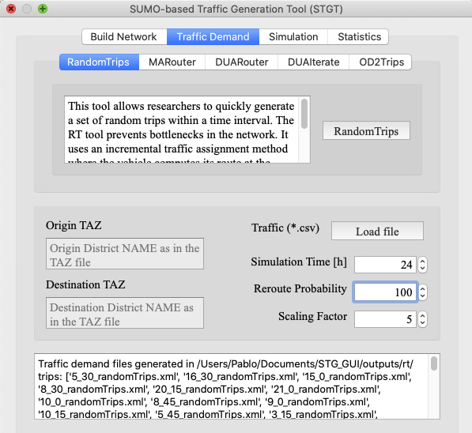

<p align="left">
  
</p>

# Automating SUMO traffic demand generation tool [STGT] #

STG allows to SUMO users to quickly and easily execute generate traffic demnd for their own sceanrios (i.e., net file). 
This is an automation tool for SUMO that generate required confgiration files for SUMO tools. 
Based on SUMO templates structure, this tool reads templates folder and generate configration files  and execute simulations.
Required inputs include: SUMO valid installation, .ned (road network), real traffic (.csv), origin/destination zones (TAZs).
 
 
Additionally, the STGT tool is provided with GUI and CLI interfaces that guide novice/advanced users through the whole process, from generating the network till process simulation outputs. Novice users are benefited from the previous advanced knowledge requirement regarding the SUMO simulator. Advanced users benefit from the modularity of the STGT tool, which allows us to independently generate the network, the traffic demand, or to run simulations without the necessity of going through the whole process. 
 

Feature highlights 
------------------

* Supports Python >= 3.5;
* Fine grane control of the SUMO traffic generation tools;
* Customizable/interactive plotting
* Runs parallelized simulations;


# STGT GUI #

At the moment, users can clone the repository and execute the stgt.py script.

We are working on releasing an accessible install version. 


<p align="left">
  
</p>

<p align="left">
  
</p>

<p align="left">
  
</p>

<p align="left">
  
</p>


# STGT CLI #

STG includes the following tool:    
```bash
  - run: Generates traffic demand based on the selected SUMO tool. Executes simulations.
```

```bash
    # stg run --help
    Usage: stg run [OPTIONS]
    
      STG SUMO Traffic generator. Required options: tool, -O, -D,
    
    Options:
      -s, --sumo-bin PATH          SUMO bin directory.
      -net PATH                    Net file converted to SUMO readable file (.net)
      -T, --real-traffic PATH      Path to real traffic file with .csv format.
      -O, --O-district-name TEXT   Origin district name as in TAZ file.
      -D, --D-district-name TEXT   Destination district name as in TAZ file.
      -o, --outputs PATH           Output directory (route traces, statistics).
      -ma                          MARouter SUMO tool
      -dua                         DUARouter SUMO tool
      -duai                        DUAIterate SUMO tool
      -rt                          RandomTrips SUMO tool
      -od2                         OD2Trips SUMO tool
      -i, --iterations INTEGER     DUAIterate number of iterations  [default: 1]
      -reroute                     Enable SUMO reroute capabilities.  [default:
                                   False]
    
      -gui                         Graffical interface for SUMO simulations
      -p, --max-processes INTEGER  The maximum number of parallel simulations. [
                                   default available cpus are used ]
    
      -t, --sim-time INTEGER       Number of hours to simulate  (e.g., 24 hours)
                                   [default: 1]
    
      -n, --repetitions INTEGER    Number of repetitions.  [default: 1]
      --help                       Show this message and exit. 
```

## Clone the repository ##
The STG package is developed using a pipenv. TO install osm on a virtual environment:
```bash
pip3 install pipenv
```

To clone the osm repository, on the command line, enter:
```bash
git clone https://github.com/Pbarbecho/STG.git
```
On the new venv, install osm project in an editable mode:

```bash
pipenv install -e stg/
```

Then, for use the new virtual environment instantiate a sub-shell as follows:

```bash
pipenv shell
```

At this time, you can interact with the STG modules.

## Downloading modules ##

Install osm using pip:
```bash
pip3 install --user -U https://github.com/Pbarbecho/osm/archive/master.zip
```

Depending on the operating system, you may need to add ~/.local/bin to your path. During the installation you will be warned about this.
 
 
In case you want to uninstall osm package: 

```bash
pip3 uninstall stg
```


Cite: Pablo Barbecho Bautista, Luis Urquiza-Aguiar, Mónica Aguilar Igartua, "STGT: SUMO-Based Traffic Mobility Generation Tool for Evaluation of Vehicular Networks", 18th ACM Symposium on Performance Evaluation of Wireless Ad Hoc, Sensor, & Ubiquitous Networks (PE-WASUN 2021), pp. 17–24, DOI:10.1145/3479240.3488523, Alicante, Spain. 22nd - 26th November 2021.

## Authors ##

Pablo Barbecho
